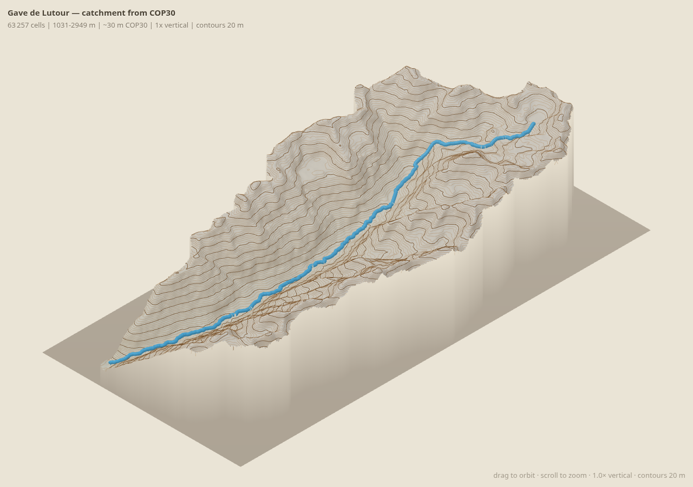
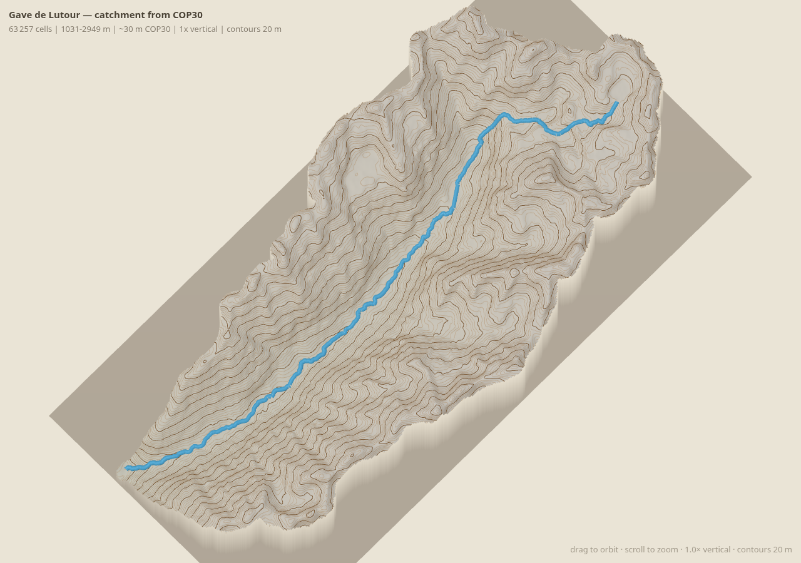

# valleespyr

3D visualization of mountain valleys in the Pyrénées (France), built from open
topographic and hydrographic data.

## Status

Early scaffold. Two things work today:

- a **CLI** to pull BD TOPO watershed polygons and stream-network topology from
  the IGN Géoplateforme WFS, and roll the fine river segments up into a
  browsable "flows into" graph;
- a **Streamlit navigator** for that graph (course + catchment map, drill into
  sub-valleys).

### 3D render prototype

First isometric render of a catchment: the **Gave de Lutour** basin, delineated
from a Copernicus GLO-30 DEM (`scratchpad/dem_lutour.py`) and rendered as a solid
diorama block in three.js — 20 m contour lines, traced stream network draped on
the surface, self-contained HTML with no server. Built by
`scratchpad/render_lutour_3d.py`.





## Install

```bash
python -m venv .venv && source .venv/bin/activate
pip install -e ".[dev]"          # add ",app" for the browser navigator,
                                 # ",dem" for the DEM catchment tools
```

## CLI

```bash
valleespyr wfs   --help    # explore a WFS source (BD TOPAGE / BD TOPO watersheds)
valleespyr hydro --help    # stream-network topology + the river graph
```

The WFS endpoint is a global option (`--wfs-endpoint`, IGN by default; Sandre
also works), so the same tooling points at another OGC source.

### Watersheds

```bash
# What watershed layers does the endpoint advertise? / its schema
valleespyr wfs layers --keyword bassin
valleespyr wfs schema

# Count / fetch polygons for a bbox (lon,lat) or a pour point
valleespyr wfs count      --bbox -0.10,42.65,0.15,42.85
valleespyr wfs watersheds --bbox -0.10,42.65,0.15,42.85 --srs EPSG:2154 -o gavarnie_ws.geojson
valleespyr wfs watersheds --point -0.0086,42.7350       -o pourpoint_ws.geojson

# Bulk-download a whole layer (paged). Format from the suffix:
#   .geojson           streamed, no extra deps
#   .parquet / .gpkg   GeoParquet / GeoPackage (needs geopandas + pyarrow)
valleespyr wfs dump                          -o data/raw/bassin_versant_fr.parquet   # all France, ~6.6k feats, ~1 min, 99 MB
valleespyr wfs dump --bbox -2,42.3,3.2,43.4  -o data/raw/bv_pyrenees.parquet         # Pyrénées, ~530 feats, 2 MB
```

IGN's file store ships BD TOPO as per-département `.7z` archives of every theme
(~1–2 GB each) behind an awkward Atom feed. The watershed layer is only ~6,600
features for all of France, so paging the WFS is the simpler bulk source. Use the
file store if you need the fine stream-topology layers.

### River graph

`hydro rivers` rolls the fine `troncon_hydrographique` segments up into whole
**rivers** (keyed by BD TOPO's `cours_d_eau` id) and connects them into a "flows
into" DAG. Per river you get: Strahler order, total length, the rivers in its
catchment (recursive), its parent (the river downstream), and root / leaf state.

```bash
# Rivers in a loaded network, longest first
valleespyr hydro rivers list --from-file data/raw/troncon_hydrographique_gavarnie_sample.geojson \
    --named-only --min-length-km 3

# Inspect one river; export its path or its whole catchment network
valleespyr hydro rivers show "Gave d'Ossoue" --from-file … 
valleespyr hydro rivers show "Gave de Héas"  --from-file … --geojson catchment -o heas_catchment.geojson

# Trace the raw stream network upstream of a pour point
valleespyr hydro tree --from-file … --point -0.0086,42.7350
```

`--bbox` fetches tronçons live instead of reading a file. A river whose outlet
leaves the loaded extent shows up as a *root*; dump a wider area to attach it.

### Browser navigator

```bash
pip install -e ".[app]"
streamlit run src/valleespyr/app.py      # or: valleespyr-app
```

Point it at a local `troncon_hydrographique` dump. It rolls segments up into
rivers and lets you pick one, see its course (orange) and catchment network
(blue) on a map with its stats, read tributaries biggest-first, and click into a
sub-valley or walk back down via the breadcrumb. Downloads the current river's
course or catchment as GeoJSON.

## Data model — what the layers actually contain

Everything below is BD TOPO v3, sharing `cours_d_eau` ("watercourse") ids, which
is what lets the layers join.

### `troncon_hydrographique` — river segments (lines)

A tronçon is **not** one reach between confluences: the layer splits wherever any
attribute changes (nature, width class, admin limits) *and* at junctions, so
segments are short — median **210 m**, up to 84 per named river. Confluences are
always splits.

**Connectivity** is by shared node id, not an explicit "next" field: each tronçon
carries an upstream node (`..._ini`) and a downstream one (`..._fin`) from a
shared `NOEUDHYD…` namespace. B follows A when `B.ini == A.fin`. That is the whole
topology.

Two wrinkles: node ids say how segments *touch*, not which way water flows — that
is `sens_de_l_ecoulement`, and `Sens inverse` means swap the two nodes before
adding the edge. And the graph is not one connected network — a bbox clips
trunks, and BD TOPO does not carry Spanish-side segments (`code_du_pays = ES`)
across the border, so a river whose outlet falls outside the extent surfaces as a
root. Flow is acyclic; the result is a DAG. `hydro/rivers.py` does the roll-up.

Fields used: `cleabs` (segment id), `lien_vers_noeud_hydrographique_ini/_fin`
(connectivity), `sens_de_l_ecoulement`, `liens_vers_cours_d_eau` (roll-up key),
`cpx_toponyme_de_cours_d_eau` (name, ~38% of segments), `numero_d_ordre`
(Strahler, drives line width), `nature` (natural flow vs canal / conduit / lake),
`fictif` (virtual link through a lake or braid), `reseau_principal_coulant`.

### `bassin_versant_topographique` — sub-catchments (polygons)

Polygons that tile the drainage area, one per **reach** of a watercourse rather
than per whole river — `toponyme` reads "Le Gave de Pau du confluent de l'Ouzom
au confluent du Béez". Each is keyed to its watercourse via
`liens_vers_cours_d_eau_principal`. Coarse (median **49 km²**, from BD Carthage at
20 m precision) and sparse — in the Gavarnie sample only 10 of 367 rivers get a
polygon.

The union of the sub-basins for a river *and every river upstream of it* is that
river's real catchment area (`watershed.catchment_polygon`) — a drainage area,
not a hull around the lines. Caveat: keyed to a *whole* watercourse, so the
dissolve over-reaches for a river the tronçon dump cuts off mid-course.

Fields used: `liens_vers_cours_d_eau_principal` (join key), `cleabs`, `toponyme`,
`code_bdcarthage` / `code_hydrographique`.

## Layout

```
config/            per-valley config (bbox, pour point, CRS, source URLs)
src/valleespyr/
  cli.py           click CLI  (groups: wfs, hydro)
  watershed.py     fetch / select watershed polygons; catchment_polygon() dissolve
  dump.py          bulk-download a layer (paged) to GeoJSON / GeoParquet / GPKG
  app.py           Streamlit river-graph navigator
  sources/wfs.py   minimal OGC WFS 2.0 client
  hydro/
    network.py     troncon_hydrographique -> downstream-pointing DiGraph
    trace.py       snap a pour point, trace upstream, shape as a tree
    rivers.py      roll segments up into a river graph
scratchpad/        DEM catchment demo + 3D render builder (dem_lutour.py,
                   render_lutour_3d.py)
data/raw|processed gitignored working data
tests/             offline unit tests
```

## First valley

`config/gavarnie.yaml` — Gave de Pau headwaters / Cirque de Gavarnie
(Hautes-Pyrénées). Compact, dramatic relief, entirely on the French side.
