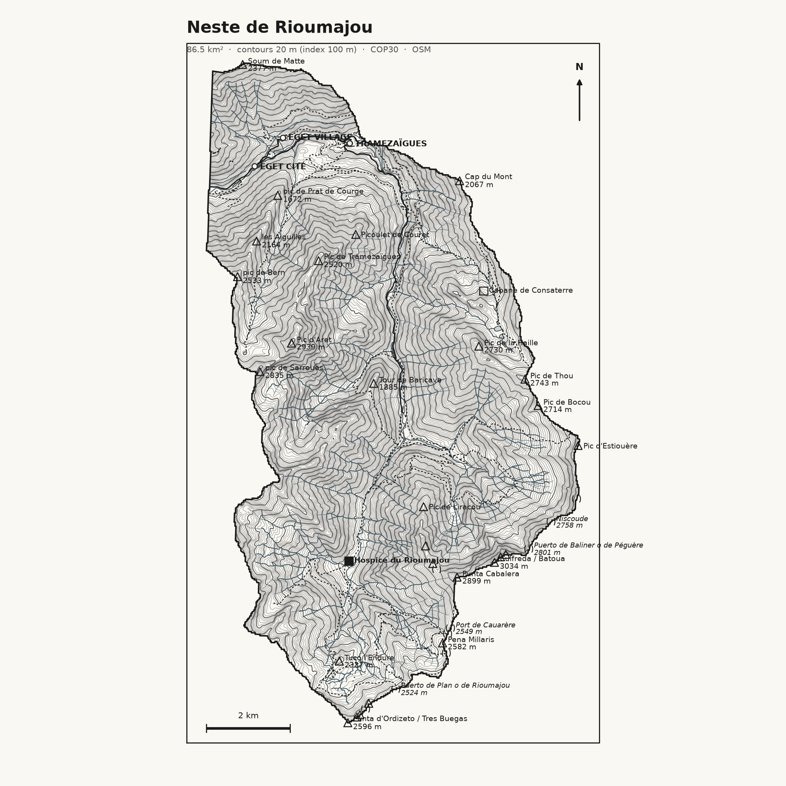
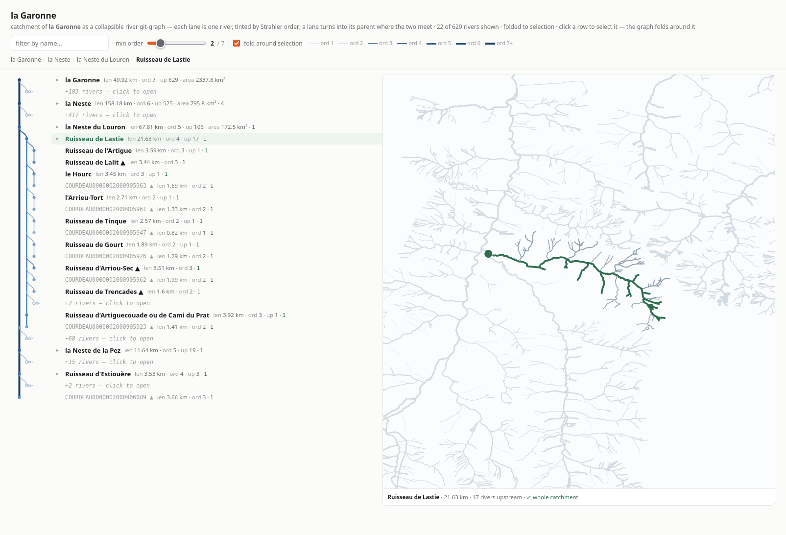

# valleespyr

3D visualization of mountain valleys in the Pyrénées (France), built from open
topographic and hydrographic data.

**Live catalog:** https://xdze2.github.io/versants/

## Status

Early scaffold. Two things work today:

- a **CLI** to pull BD TOPO watershed polygons and stream-network topology from
  the IGN Géoplateforme WFS, and roll the fine river segments up into a
  browsable "flows into" graph;
- a **Streamlit navigator** for that graph (course + catchment map, drill into
  sub-valleys).

### 3D render prototype

First isometric render of a catchment: the **Gave de Lutour** basin, delineated
from a Copernicus GLO-30 DEM (`scratchpad/dem_lutour.py`) and rendered as a solid
diorama block in three.js — 20 m contour lines, traced stream network draped on
the surface, self-contained HTML with no server. Built by
`scratchpad/render_lutour_3d.py`.


### 2D topo plate prototype

First `valley plate` output: the **Neste de Rioumajou** catchment (86 km²,
straddles the FR/ES border) as a minimal black-and-white topo plate — 20 m
contours from COP30, the BD TOPO stream network, and the human layer (trails,
hiking routes, roads, refuges/cabanes, named summits and cols) pulled from
OpenStreetMap in one Overpass query. Built by
`valleespyr valley plate "Neste de Rioumajou" --from-file … -o rioumajou.svg`.

Rough first pass — contours are over-dense, unnamed peaks are unfiltered and
labels collide; a styling pass is pending (keep 20 m contours but lighten the
minor lines so the human layer reads on top).



### Valley catalog — browse the basin like a git history

`valleespyr catalog` walks the river graph from a chosen root into a nested JSON
tree and (optionally) one self-contained HTML page. The mental model is a **git
commit graph**, not a directory:

| git | valley graph |
|---|---|
| commit | a river (opaque stable id = its `cours_d_eau`) |
| parent commit | the river it flows into |
| merge commit | a confluence |
| `main` | the trunk to the sea |
| `git log --first-parent` | the trunk walked from a headwater back to the root |

Each node splits its upstream neighbours into a **`mainline`** (the one child
that continues the same valley upstream — the dominant water path, `HEAD~1` on
the same branch) and **`tributaries`** (every other child, each the tip of a
branch that merges in at this confluence, biggest sub-catchment first). Walking
`mainline` repeatedly follows the trunk to its source. A river with more than one
downstream (a real bifurcation) appears once, under its first downstream, with
the alternates in `also_flows_into`.

Every node carries length, Strahler order, valleys upstream and a study-local
Pfafstetter code; passing a `bassin_versant_topographique` dump also fills in a
drainage `area_km2` where a sub-basin covers the valley.

```bash
valleespyr catalog COURDEAU0000002000894629 \
    --from-file data/raw/troncon_hydrographique_pyrenees.parquet \
    --bassins data/raw/bassin_versant_topographique_pyrenees.parquet \
    --max-depth 8 \
    -o data/processed/garonne_catalog.json \
    --html data/processed/garonne_catalog.html
```

The root is a river name (case-insensitive substring) or a `COURDEAU…` id;
`--max-depth` counts confluences, not free mainline hops. The HTML is a static
**river git-graph**: one lane per river, tinted and thickened by Strahler order
(dark trunk, pale headwaters); a lane runs unbroken past every tributary that
hangs off it and curves left into its parent where the two meet. One row per
river — the reach-splits BD TOPO makes inside a watercourse are not drawn —
with the name and facts to the right, `▲` marking a source and `+N` a folded
branch. One file — inline CSS + a few lines of JS for a name filter — no server,
no CDN.



The Pfafstetter code is **study-local**: it is a path from the chosen root over
the loaded (bbox-clipped) network, so it sorts and gives an "is-upstream-of"
test *within one catalog* but is not comparable across catalogs or to published
datasets. Fix the root (always build from `la Garonne`) for stable codes.

## Install

```bash
python -m venv .venv && source .venv/bin/activate
pip install -e ".[dev]"          # add ",app" for the browser navigator,
                                 # ",dem" for the DEM catchment tools
```

## CLI

```bash
valleespyr wfs    --help   # explore a WFS source (BD TOPAGE / BD TOPO watersheds)
valleespyr hydro  --help   # stream-network topology + the river graph
valleespyr valley --help   # pick a river and build its 3D catchment render
```

The WFS endpoint is a global option (`--wfs-endpoint`, IGN by default; Sandre
also works), so the same tooling points at another OGC source.

### Watersheds

```bash
# What watershed layers does the endpoint advertise? / its schema
valleespyr wfs layers --keyword bassin
valleespyr wfs schema

# Count / fetch polygons for a bbox (lon,lat) or a pour point
valleespyr wfs count      --bbox -0.10,42.65,0.15,42.85
valleespyr wfs watersheds --bbox -0.10,42.65,0.15,42.85 --srs EPSG:2154 -o gavarnie_ws.geojson
valleespyr wfs watersheds --point -0.0086,42.7350       -o pourpoint_ws.geojson

# Bulk-download a whole layer (paged). Format from the suffix:
#   .geojson           streamed, no extra deps
#   .parquet / .gpkg   GeoParquet / GeoPackage (needs geopandas + pyarrow)
valleespyr wfs dump                          -o data/raw/bassin_versant_fr.parquet   # all France, ~6.6k feats, ~1 min, 99 MB
valleespyr wfs dump --bbox -2,42.3,3.2,43.4  -o data/raw/bv_pyrenees.parquet         # Pyrénées, ~530 feats, 2 MB
```

IGN's file store ships BD TOPO as per-département `.7z` archives of every theme
(~1–2 GB each) behind an awkward Atom feed. The watershed layer is only ~6,600
features for all of France, so paging the WFS is the simpler bulk source. Use the
file store if you need the fine stream-topology layers.

### River graph

`hydro rivers` rolls the fine `troncon_hydrographique` segments up into whole
**rivers** (keyed by BD TOPO's `cours_d_eau` id) and connects them into a "flows
into" DAG. Per river you get: Strahler order, total length, the rivers in its
catchment (recursive), its parent (the river downstream), and root / leaf state.

```bash
# Rivers in a loaded network, longest first
valleespyr hydro rivers list --from-file data/raw/troncon_hydrographique_gavarnie_sample.geojson \
    --named-only --min-length-km 3

# Inspect one river; export its path or its whole catchment network
valleespyr hydro rivers show "Gave d'Ossoue" --from-file … 
valleespyr hydro rivers show "Gave de Héas"  --from-file … --geojson catchment -o heas_catchment.geojson

# Trace the raw stream network upstream of a pour point
valleespyr hydro tree --from-file … --point -0.0086,42.7350
```

`--bbox` fetches tronçons live instead of reading a file. A river whose outlet
leaves the loaded extent shows up as a *root*; dump a wider area to attach it.

### Browser navigator

```bash
pip install -e ".[app]"
streamlit run src/valleespyr/app.py      # or: valleespyr-app
```

Point it at a local `troncon_hydrographique` dump. It rolls segments up into
rivers and lets you pick one, see its course (orange) and catchment network
(blue) on a map with its stats, read tributaries biggest-first, and click into a
sub-valley or walk back down via the breadcrumb. Downloads the current river's
course or catchment as GeoJSON.

### Valleys — pick one and render it

`valley` chains the river graph to the DEM catchment tools and the 3D diorama.
Pick a river with `valley list`, get its terrain-delineated catchment polygon
with `valley catchment`, or go straight to a self-contained HTML render with
`valley render`. `catchment` and `render` fetch a Copernicus DEM tile live and
need `OPENTOPOGRAPHY_API_KEY` set.

```bash
# Render candidates in a loaded network (trimmed 'hydro rivers list')
valleespyr valley list --from-file data/raw/troncon_hydrographique_gavarnie_sample.geojson \
    --named-only --min-length-km 5

# DEM catchment polygon for one river, as GeoJSON
valleespyr valley catchment "Gave de Lutour" \
    --from-file data/raw/troncon_hydrographique_pyrenees.parquet -o lutour_catchment.geojson

# Full chain -> one self-contained .html (three.js from a CDN at view time, no server)
valleespyr valley render "Gave de Lutour" \
    --from-file data/raw/troncon_hydrographique_pyrenees.parquet --exaggeration 1.5 -o lutour_3d.html
```

## Method

How the river tree is derived from BD TOPO, and how catchment polygons are
computed (WFS sub-basins + DEM delineation) — data sources, algorithms,
parameters, and the difficulties found along the way (axis-order quirks,
confluence ambiguity, DEM crashes, ...) are all in **[METHOD.md](METHOD.md)**.

## Layout

```
config/            per-valley config (bbox, pour point, CRS, source URLs)
src/valleespyr/
  cli.py           click CLI  (groups: wfs, hydro, valley)
  watershed.py     fetch / select watershed polygons; catchment_polygon() dissolve
  dump.py          bulk-download a layer (paged) to GeoJSON / GeoParquet / GPKG
  app.py           Streamlit river-graph navigator
  sources/wfs.py   minimal OGC WFS 2.0 client
  catalog.py       river graph -> git-shaped valley-tree JSON (mainline /
                   tributaries, Pfafstetter, area)
  hydro/
    network.py     troncon_hydrographique -> downstream-pointing DiGraph
    trace.py       snap a pour point, trace upstream, shape as a tree
    rivers.py      roll segments up into a river graph
  render/
    catalog_html.py  valley-tree JSON -> a self-contained static river git-graph
scratchpad/        DEM catchment demo + 3D render builder (dem_lutour.py,
                   render_lutour_3d.py)
data/raw|processed gitignored working data
tests/             offline unit tests
```

## First valley

`config/gavarnie.yaml` — Gave de Pau headwaters / Cirque de Gavarnie
(Hautes-Pyrénées). Compact, dramatic relief, entirely on the French side.
